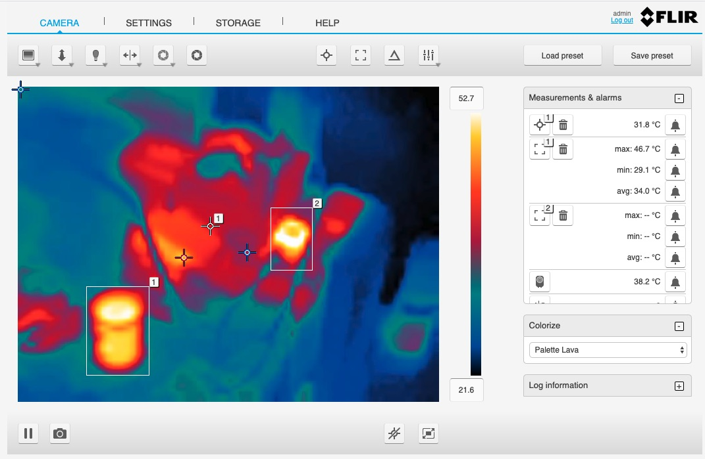

.. Images

.. |AX8_1| image:: images/AX8_1.jpg

Flir AX8 Thermal Imaging Camera
===============================

The *fledge-south-FlirAX8* plugin is a south plugin that enables temperature data to be collected from Flir Thermal Imaging Devices, in particular the AX8 and other A Series cameras. The camera provides a number of temperatures for both spots and boxes defined within the field of view of the camera. In addition it can also provide deltas between two temperature readings.

The bounding boxes and spots to read are configured by connecting to the web interface of the camera and dropping the spots on a thermal imaging or pulling out rectangles for the bounding boxes.

+--------------+
| |flir_setup| |
+--------------+

In order to configure a south service to obtain temperature data from a Flir camera select the *South* option from the left-hand menu bar and click on the Add icon in the top right corner of the South page that appears. Select the *FlirAX8* plugin from the list of south plugins, name your service and click on *Next*.

The screen that appears is the configuration screen for the *FlirAX8* plugin.

+---------+
| |AX8_1| |
+---------+

The important data to add here is the IP address of the camera, in the entry field labeled *Server Address* and the name of the asset to be created within Fledge.

Once entered click on *Next*, enable the service on the next page and click on *Done*.
